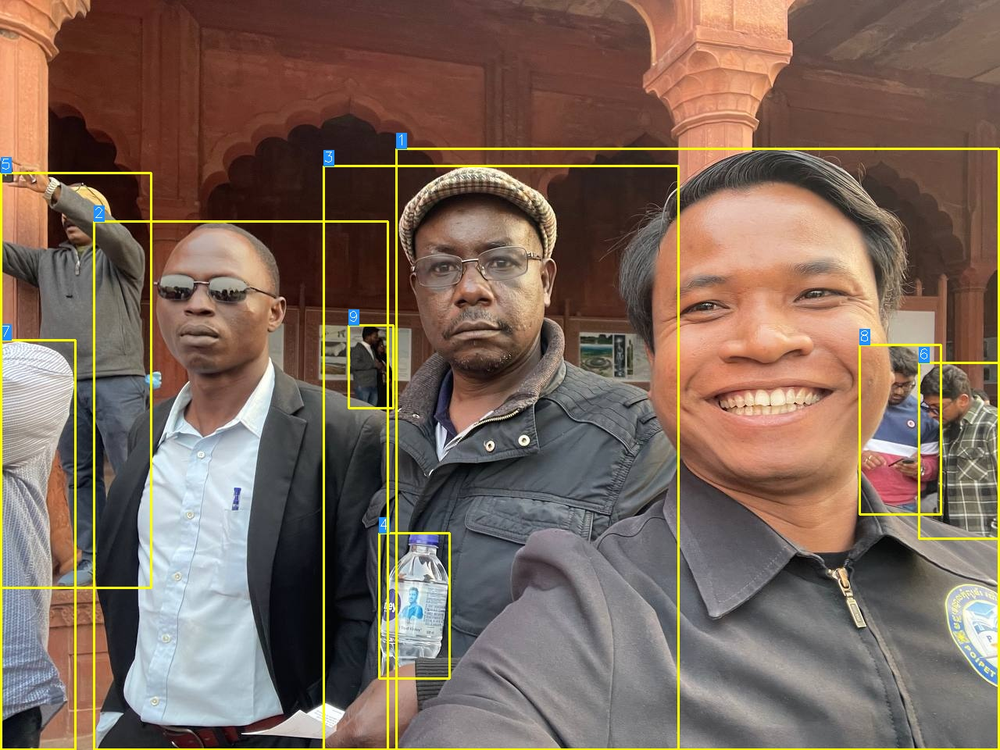

<div align="center">

<!-- Header Banner -->

<p align="center">
  
</p>

<h1 align="center">🎯 YOLOv8 Object Tracking</h1>

<p align="center">
  <strong>Precision-driven real-time object tracking | Built with Ultralytics YOLOv8</strong>
</p>

<p align="center">
  
  
  
  
  
</p>

<p align="center">

  
</p>
<!-- Badges Row -->
<br/>
<br/>


</div>

---

## Overview

A **lightweight, production-ready** object tracking pipeline built on **YOLOv8** — one of the fastest and most accurate detection architectures available. This repository integrates the SORT tracking algorithm with Ultralytics' inference engine to deliver frame-by-frame identity-consistent multi-object tracking across any input source.

Engineered for compatibility with `ultralytics==8.0.0`, it is ready for use in surveillance systems, autonomous vehicle pipelines, sports analytics, and industrial motion monitoring.

> **Tip** — For the latest upstream improvements, check the official [Ultralytics repository](https://github.com/ultralytics/ultralytics/).

---

## Architecture

```
yolov8-object-tracking/
│
├── models/                        # Core model definitions
│   ├── v8/                        # YOLOv8 variants — nano, small, medium, large, x, x6
│   ├── nn/                        # Neural network building blocks
│   └── yolo/                      # YOLO config and helper utilities
│
├── data/                          # Dataset loading and augmentation pipeline
├── engine/                        # Training and validation engine
├── utils/                         # Shared utility functions
│
├── v8/                            # Version-specific modules
│   └── detect/                    # Tracking and detection scripts
│       ├── cli.py                 # Command-line interface
│       └── detect_and_trk.py     # Primary tracking handler
│
└── README.md
```

---
**Latest Detection Result:**


**Video Detection Results:**
- [YOLOv8m Video Detection](https://github.com/SereyodamChek/YOLOv-8-Object-Tracking/raw/main/results/video1.mp4) (Download MP4 - 6.3MB)
- Note: GitHub doesn't preview large video files inline. Use the raw download link above.

## Installation

**Step 1 — Clone the repository**

```bash
git clone https://github.com/SereyodamChek/yolov8-object-tracking.git
cd yolov8-object-tracking
```

**Step 2 — Install dependencies**

```bash
pip install ultralytics==8.0.0
```

> **Warning** — This implementation is validated against `ultralytics==8.0.0` only. Newer versions may introduce API-breaking changes. Pin your environment accordingly.

---

## 🚀 Quick Start (5 Minutes)

### Step 1: Clone & Install
```bash
git clone https://github.com/SereyodamChek/YOLOv-8-Object-Tracking.git
cd YOLOv-8-Object-Tracking
pip install -r requirements.txt
```

### Step 2: Run on Sample Image
```bash
py -3.13 yolo/v8/detect/detect_and_trk.py model=yolov8m.pt source="sample.jpg"
```

### Step 3: Check Results
Output saved to `runs/detect/train/` — open the generated image to see detections with tracking IDs.

---

## 📖 Complete Tutorial

### Prerequisites
- **Python 3.13** (required for Hydra compatibility)
- **GPU optional** (runs on CPU, slower)
- **2GB+ free disk space** for model downloads
- **Webcam or video file** for input

### Installation with Virtual Environment (Recommended)

**1. Create Python 3.13 virtual environment:**
```bash
python -m venv venv
venv\Scripts\activate
```

**2. Install dependencies:**
```bash
pip install -r requirements.txt
```

**3. Verify installation:**
```bash
py -3.13 -c "import torch; import cv2; print('✓ All packages installed')"
```

### Common Issues & Solutions

| Issue | Solution |
|-------|----------|
| `ModuleNotFoundError: skimage` | `pip install scikit-image` |
| `Python 3.14 Hydra error` | Use `py -3.13` instead of `python` |
| `CUDA out of memory` | Use smaller model: `yolov8n.pt` instead of `yolov8x.pt` |
| `No module: sort` | Ensure you're in project root directory |

---

## 📹 Usage Examples

### 🎬 Video File Tracking
```bash
py -3.13 yolo/v8/detect/detect_and_trk.py model=yolov8m.pt source="video.mp4"
```
**Output:** `runs/detect/train/video.mp4` (with tracking overlays)

### 🖼️ Image Detection
```bash
py -3.13 yolo/v8/detect/detect_and_trk.py model=yolov8m.pt source="image.jpg"
```
**Output:** `runs/detect/train/image.jpg` (with bounding boxes and IDs)

### 📹 Webcam Real-Time Tracking
```bash
py -3.13 yolo/v8/detect/detect_and_trk.py model=yolov8m.pt source=0 show=True
```
**Parameters:**
- `source=0` → Default webcam
- `source=1` → External camera (if available)
- `show=True` → Display live preview

### 🎥 Video File with Live Display
```bash
py -3.13 yolo/v8/detect/detect_and_trk.py model=yolov8s.pt source="video.mp4" show=True conf=0.5
```

### 🔧 Advanced Examples

**High-accuracy detection (slower):**
```bash
py -3.13 yolo/v8/detect/detect_and_trk.py model=yolov8x.pt source="video.mp4" conf=0.6
```

**Fast detection (edge devices):**
```bash
py -3.13 yolo/v8/detect/detect_and_trk.py model=yolov8n.pt source="video.mp4" conf=0.4
```

**Batch process multiple videos:**
```bash
py -3.13 yolo/v8/detect/detect_and_trk.py model=yolov8m.pt source="video1.mp4"
py -3.13 yolo/v8/detect/detect_and_trk.py model=yolov8m.pt source="video2.mp4"
```

---

## ⚙️ Parameters Explained

| Parameter | Default | Description | Example |
|-----------|---------|-------------|---------|
| `model` | - | YOLO model file | `yolov8m.pt`, `yolov8s.pt` |
| `source` | - | Input: image, video, webcam (0/1) | `"video.mp4"`, `0`, `"image.jpg"` |
| `show` | False | Display live preview window | `show=True` |
| `conf` | 0.25 | Confidence threshold (0-1) | `conf=0.5` (higher = fewer false positives) |
| `iou` | 0.45 | IoU threshold for NMS | `iou=0.5` |
| `imgsz` | 640 | Inference image size | `imgsz=416` (smaller = faster, less accurate) |
| `device` | 0 | GPU device ID (0, 1...) or 'cpu' | `device=0`, `device=cpu` |
| `line_thickness` | 2 | Bounding box line thickness | `line_thickness=3` |

---

## 📊 Output Files

Results are saved to `runs/detect/train/` with this structure:

```
runs/detect/train/
├── image1.jpg          # Image with detections
├── image2.jpg
├── video1.mp4          # Video with tracking overlay
└── labels/             # Detection annotations (optional)
    ├── image1.txt
    └── image2.txt
```

**Output Format (each detection line):**
```
<x_center> <y_center> <width> <height> <class_id> <confidence>
```

---

## 🎯 Understanding Output

### Tracking IDs
- Each detected object gets a **unique ID** (drawn in orange box)
- IDs persist across frames for the same person/object
- ID changes when object leaves frame and re-enters

### Bounding Boxes
- **Cyan rectangle** → Detection bounding box
- **Orange box + ID** → Tracking identifier
- **Lines** → Movement trajectory of tracked objects

### Confidence Scores
- Higher confidence (closer to 1.0) = more reliable detection
- Adjust `conf` parameter to filter low-confidence detections

---

## 📈 Choosing the Right Model

| Model | File Size | Speed | Accuracy | Best For |
|-------|-----------|-------|----------|----------|
| `yolov8n.pt` | 3.2 MB | ⚡⚡⚡ Fastest | ★★☆ | Edge devices, real-time (30+ FPS) |
| `yolov8s.pt` | 11.2 MB | ⚡⚡ Fast | ★★★ | Real-time video (15-25 FPS) |
| `yolov8m.pt` | **25.9 MB** | ⚡ Balanced | ★★★★ | **Recommended** - General purpose |
| `yolov8l.pt` | 43.7 MB | ◑ Moderate | ★★★★ | High accuracy needed |
| `yolov8x.pt` | 68.2 MB | ◎ Slow | ★★★★★ | Maximum precision (2-5 FPS) |

**GPU Memory Requirements:**
- `n/s` models: 2GB (runs on most GPUs)
- `m/l` models: 4-6GB
- `x` model: 8GB+

---

## 🆘 Troubleshooting

### Issue: "FileNotFoundError: Model not found"
**Solution:** Models auto-download on first use. Ensure internet connection.

### Issue: "CUDA out of memory"
**Solution:** Use smaller model or reduce `imgsz`:
```bash
py -3.13 yolo/v8/detect/detect_and_trk.py model=yolov8n.pt source="video.mp4" imgsz=416
```

### Issue: Slow performance
**Solutions:**
- Use `yolov8n.pt` instead of larger models
- Reduce `imgsz` (640 → 416)
- Skip `show=True` to save time
- Use GPU: `device=0` (if available)

---

## Model Variants

| Model | Size | Speed | Accuracy | Best For |
|---|---|---|---|---|
| `yolov8n.pt` | 3.2 MB | ⚡ Fastest | ★★☆☆☆ | Edge / embedded devices |
| `yolov8s.pt` | 11.2 MB | ⚡ Fast | ★★★☆☆ | Real-time inference |
| `yolov8m.pt` | 25.9 MB | ◑ Balanced | ★★★★☆ | General purpose |
| `yolov8l.pt` | 43.7 MB | ◑ Moderate | ★★★★☆ | High-accuracy tasks |
| `yolov8x.pt` | 68.2 MB | ◎ Slower | ★★★★★ | Maximum precision |


---

## How It Works

```
┌─────────────────┐     ┌──────────────────┐     ┌──────────────────────┐
│   Input Source  │────▶│  YOLOv8 Detector │────▶│   SORT Tracker       │
│  Video / Image  │     │  Bounding Boxes  │     │  ID Assignment       │
│  Webcam / RTSP  │     │  + Class Labels  │     │  Kalman Filtering    │
└─────────────────┘     └──────────────────┘     └──────────┬───────────┘
                                                             │
                                                             ▼
                                                  ┌──────────────────────┐
                                                  │  Annotated Output    │
                                                  │  Tracked IDs overlaid│
                                                  │  Saved to runs/      │
                                                  └──────────────────────┘
```

Detection bounding boxes from YOLOv8 are fed into a SORT (Simple Online Realtime Tracking) layer, which uses Kalman filters and the Hungarian algorithm to consistently assign unique IDs to objects across frames — even under occlusion or brief disappearance.

---

## References

| Resource | Description |
|---|---|
| [Ultralytics YOLOv8](https://github.com/ultralytics/ultralytics) | Official framework and pretrained weights |
| [SORT Algorithm](https://github.com/abewley/sort) | Simple Online Realtime Tracking paper & implementation |
| [YOLOv8 Docs](https://docs.ultralytics.com/) | Complete API reference and training guides |

---

## Author

<div align="center">

**SereyodamChek**

[](https://github.com/SereyodamChek)
[](https://github.com/SereyodamChek/yolov8-object-tracking)

</div>

---

<div align="center">


**© 2025 SereyodamChek — Released under [GPL-3.0 License](LICENSE)**

</div>
